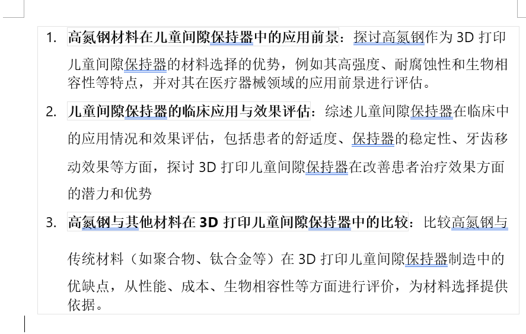

逆天

**奥氏体一般由等轴状的多边形晶粒组成，晶粒内有**[孪晶](https://baike.baidu.com/item/孪晶/0?fromModule=lemma_inlink)。在加热转变刚刚结束时的[奥氏体晶粒](https://baike.baidu.com/item/奥氏体晶粒/4616141?fromModule=lemma_inlink)比较细小，晶粒边界呈不规则的弧形。经过一段时间加热或保温，晶粒将长大，晶粒边界可趋向平直化。铁碳相图中奥氏体是高温相，存在于临界点A1温度以上，是[珠光体](https://baike.baidu.com/item/珠光体/0?fromModule=lemma_inlink)逆共析转变而成。当钢中加入足够多的扩大奥氏体相区的化学元素时，Ni、Mn等，则可使奥氏体稳定在室温，如奥氏体钢。^ [2]^

**铁素体在912°C至1394°C时会相变成奥氏体，由体心立方的结构变成面心立方。奥氏体强度较低，但其溶碳能力较大（1146°C时可以溶进2.04%的碳）。奥氏体系列的不锈钢常用于食品工业和外科手术器材。**

# 2024  3.3

下周准备发一篇综述，大家根据我发的这几个方向（可稍微改动添加），每人搜文献查资料整理看看哪个好写点，明天下午15：00点咱开会，说

①自己的选题，搜的资料依据

②大概要写的框架

③最后确定选题；时间比较紧急后期大创结不了题怕对大家都有影响
